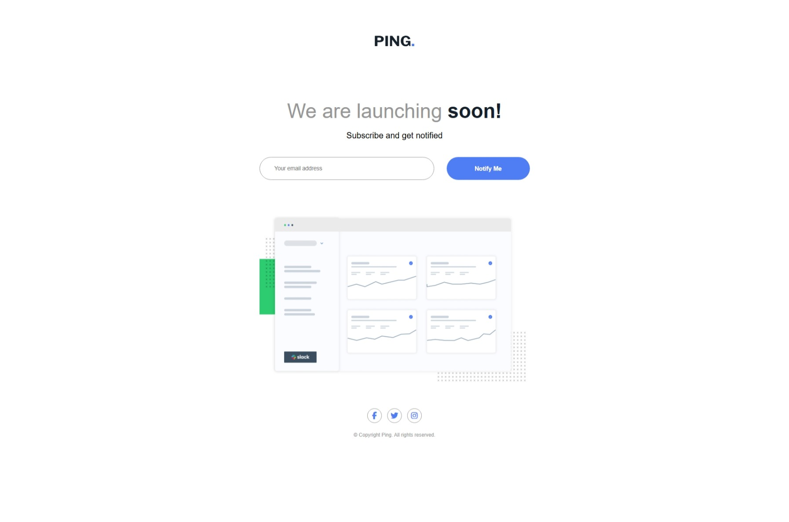

# Frontend Mentor - Ping coming soon page solution

This is a solution to the [Ping coming soon page challenge on Frontend Mentor](https://www.frontendmentor.io/challenges/ping-single-column-coming-soon-page-5cadd051fec04111f7b848da). Frontend Mentor challenges help you improve your coding skills by building realistic projects. 

## Table of contents

- [Overview](#overview)
  - [The challenge](#the-challenge)
  - [Screenshot](#screenshot)
  - [Links](#links)
- [My process](#my-process)
  - [Built with](#built-with)
  - [What I learned](#what-i-learned)
  - [Continued development](#continued-development)
  - [Useful resources](#useful-resources)
- [Author](#author)

## Overview

### The challenge

Users should be able to:

- View the optimal layout for the site depending on their device's screen size
- See hover states for all interactive elements on the page
- Submit their email address using an `input` field
- Receive an error message when the `form` is submitted if:
	- The `input` field is empty. The message for this error should say *"Whoops! It looks like you forgot to add your email"*
	- The email address is not formatted correctly (i.e. a correct email address should have this structure: `name@host.tld`). The message for this error should say *"Please provide a valid email address"*

### Screenshot



### Links

- Solution URL: [Frontend Mentor Solution](https://your-solution-url.com)
- Live Site URL: [Ping single column coming soon page deployement](https://osmond20.github.io/Ping-single-column-coming-soon-page/)

## My process

### Built with

- Semantic HTML5 markup
- CSS custom properties
- Flexbox
- CSS Grid
- Mobile-first workflow
-[SCSS](https://sass-lang.com/guide/) - CSS Preprocessor

### What I learned

I learned that when designing for dekstop layout, it is far better to design on the laptop layout than using a desktop screen. And I am glad I figured out how to validate the email using basic regex and bringing the functionality of the website together using JS.

```js
// function to validate the email using basic email format
function validateInput(email){
    let regex = /^[^\s@]+@[^\s@]+\.[^\s@]+$/
    let result = regex.test(email);
    return result;
};
```

### Continued development

I will be focusing on coding with JS functionality while maintaining responsive design practices.

### Useful resources

- [FreeCodeCamp](https://www.freecodecamp.org/learn/javascript-v9) - This helped with the JS functionality for the email validation.

## Author

- Website - [Github](https://www.github.com/osmond20)
- Frontend Mentor - [@osmond20](https://www.frontendmentor.io/profile/osmond20)
- Twitter - [@yourusername](https://www.twitter.com/yourusername)

